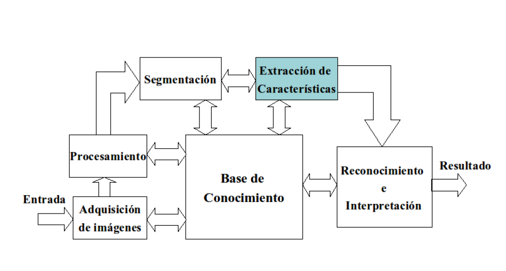

# Proyecto Técnicas de Inteligencia artificial 2021-II

Este repositorio contiene el desarrollo del proyecto de Técnicas de Inteligencia artificial. Donde se busca aplicar los conocimientos adquiridos en clase.


# Pipeline 
1. Ingreso de Datos: Las imágenes se encuentran ubicadas bajo la carpeta [data](./data), estas se encuentran clasificadas en subcarpetas según el tipo de señal que sean. Se crea una lista del nombre de archivo de las imágenes mediante el siguiente comando
   
    ``` find data/traffic_signs -name '*.jpg' > data/traffic_filename_list.txt```

2. Preprocesamiento
3.  Segmentación 
4.  Clasificadores 




